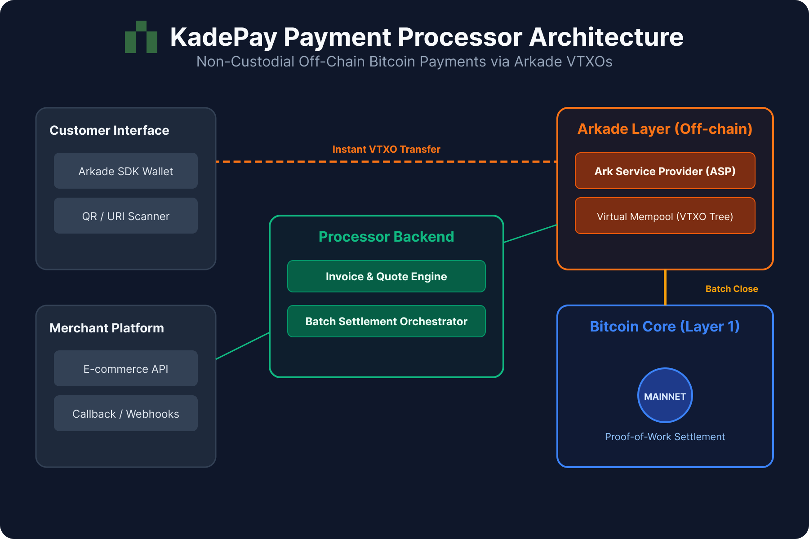

<h1 align="center">
 KadePay
</h1>
<p align="center">
<a href="https://github.com/KadePayments/KadePay/actions/workflows/ci.yml">

</a>
</p>

## Overview
**KadePay** is a self-hosted server for accepting off-chain Bitcoin payments powered by Arkade.
⚠ **Note:** This project is under heavy development, do not use for production.

---

## Architecture

| Modules    | Description               |
|------------|---------------------------|
| composeApp | Compose Multiplatform App |
| iosApp     | iOS App                   |

<p align="center">

</p>

---

## Getting Started

### Prerequisites
- **Kotlin 2.3+**
- **Gradle 8+**

### Installation
Clone the repository:
```bash
git clone https://github.com/KadePayments/KadePay.git
cd KadePay
```

Build the project:
```bash
./gradlew build
```
---

## Contributing
Contributions are welcome!
- Fork the repo
- Create a feature branch
- Submit a pull request

Please note that this project is **experimental**, so expect frequent changes.

### Development Environment

#### Setup Pre-commit Hook
```shell
cp scripts/pre-commit .git/hooks/
```

### Testing
#### Unit Tests
```shell
./gradlew unitTest
```

---

## License
This project is licensed under the **MIT License**. See the [License](./LICENSE) file for details.

---

## Disclaimer
This project is **experimental** and should **not** be used in production environments. Use at your own risk.

---